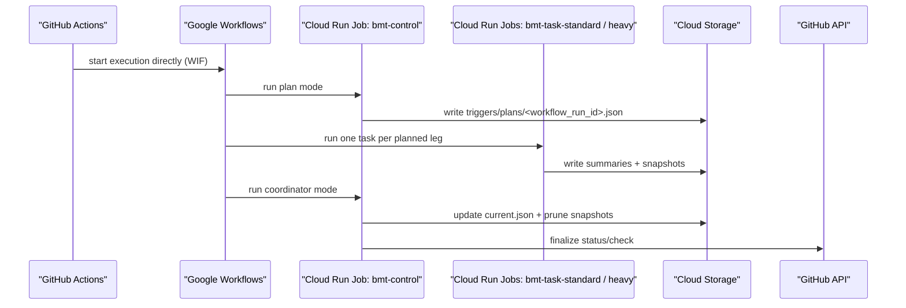
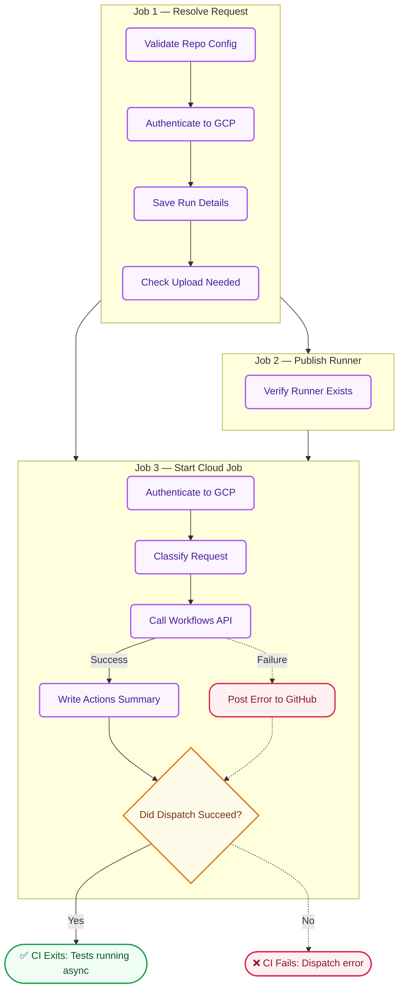
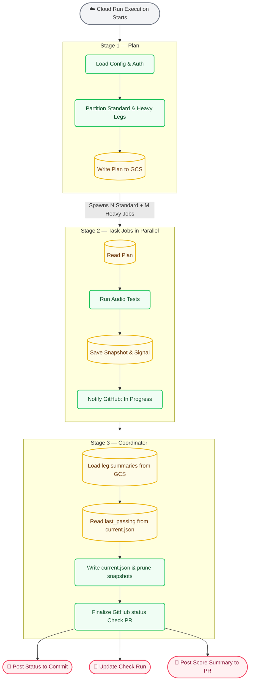

# Architecture

This is the **single** Cloud BMT architecture reference: production flow and storage (**below**), **diagrams and glossary** for onboarding, then a **maintainer deep dive** (coordination risks, weak points, remediation index).

## Production pipeline



## Runtime contract

The active runtime is the **`bmt-runtime`** workspace package ([`runtime/`](../runtime)); Cloud Run invokes [`runtime.entrypoint`](../runtime/entrypoint.py).

- `plan` reads enabled manifests and writes `triggers/plans/<workflow_run_id>.json`
- `task` reads the frozen plan and executes exactly one leg selected by `CLOUD_RUN_TASK_INDEX`
- `coordinator` reads summaries, updates pointers, prunes snapshots, and posts GitHub results
- `dataset-import` expands uploaded archives into `projects/<project>/inputs/<dataset>/`

## Storage model

- bucket root mirrors generated runtime seed output from `cloud-ci-handoff/generated/stage/`
- published manifests live under `projects/<project>/...`
- published **assets** (templates, digests, etc.) may live under `projects/<project>/plugins/<plugin>/sha256-<digest>/...`; the Python **`BmtPlugin`** is always loaded from `projects/<project>/plugin.py` on the stage tree (see `runtime/plugin_loader.py`)
- datasets live extracted under `projects/<project>/inputs/<dataset>/...`

Canonical runtime artifacts:

- `triggers/plans/<workflow_run_id>.json`
- `triggers/summaries/<workflow_run_id>/<project>-<bmt_slug>.json`
- `projects/<project>/results/<bmt_slug>/snapshots/<run_id>/latest.json`
- `projects/<project>/results/<bmt_slug>/snapshots/<run_id>/ci_verdict.json`
- `projects/<project>/results/<bmt_slug>/current.json`

## Contributor model

For **local execution, logs, and plugin work** without reading the diagrams below, see **[developer-workflow.md](developer-workflow.md)**.

- author source in root `<project>-cloud-bmt/` folders
- refresh the local stage tree with `just stage-projects` (suite root) or `just deploy` from `cloud-ci-handoff/`
- upload datasets with `just upload-data`
- inspect the live bucket with `just mount-project`

The old VM watcher, root orchestrator, and per-project `bmt_manager.py` inheritance stack have been removed from the active codebase. The supported execution path is the direct Workflow -> Cloud Run runtime only.

---

## Pipeline diagrams, glossary, and handoff

> **New to this project?** These diagrams are written to help you understand how the system works. All terms are defined below.
>
> Current state: `ci/check-bmt-gate`, 2026-03-19.

---

## Background

**Cloud Bench (batch validation pipeline)** is an automated quality check for batch workloads. It runs whenever a developer pushes code or opens a Pull Request (PR):

1. GitHub CI builds the code and uploads the test program (**runner**) to Google Cloud Storage (GCS).
2. CI starts a test job in **Google Cloud Run** and finishes immediately. It doesn't wait for the tests to finish.
3. Cloud Run executes the runner against a fixed set of input fixtures and calculates **score scores** (an quality metric).
4. Each **task** runs the project **plugin** (`prepare` → `execute` → `score` → `evaluate`). Regression vs a prior run is **plugin-defined** (the harness passes `baseline=None` unless the plugin loads a prior snapshot itself).
5. The **coordinator** updates **`current.json`** (latest / last passing pointers) and posts **pass/fail** back to GitHub. Whether a PR can merge depends on **branch protection** and the **BMT Gate** check.

### Key terms

| Term | Meaning |
| --- | --- |
| **runner** | The compiled program that actually runs the audio tests. |
| **plugin** | A project-specific Python script that sets up and invokes the runner. |
| **leg** | A single test case (one project combined with one BMT configuration). |
| **slug** | A short, URL-safe name for a BMT test suite (e.g., `false_rejects`). It is used in GCS directory paths. |
| **snapshot** | All the outputs from a single test run (scores, pass/fail status, and logs). |
| **baseline** | Prior run scores or aggregates a **plugin** may load (for example from GCS) to decide regression; pointers in **`current.json`** track which snapshot was last passing. |
| **GCS** | Google Cloud Storage. Used as a shared storage layer between GitHub CI and Cloud Run. |
| **run_id** | The unique ID of the GitHub Actions workflow. It groups all GCS files together for a single CI run. |

---

## Color key

🟦 **GitHub CI** · 🟩 **☁️ GCP / Cloud Run** · 🟨 **🪣 GCS Storage** · 🟥 **🐙 GitHub API**

---

## 1. End-to-end overview

CI starts the pipeline and stops. All testing and reporting back to GitHub happen asynchronously inside Cloud Run.

```mermaid
%%{init: {'flowchart': {'curve': 'basis'}}}%%
flowchart LR
    classDef ci fill:#eff6ff,stroke:#3b82f6,stroke-width:2px,color:#1e3a8a,rx:8px,ry:8px
    classDef gcp fill:#f0fdf4,stroke:#22c55e,stroke-width:2px,color:#14532d,rx:8px,ry:8px
    classDef gcs fill:#fefce8,stroke:#eab308,stroke-width:2px,color:#713f12,rx:8px,ry:8px
    classDef gh fill:#fff1f2,stroke:#f43f5e,stroke-width:2px,color:#881337,rx:8px,ry:8px
    classDef trigger fill:#f3f4f6,stroke:#6b7280,stroke-width:2px,stroke-dasharray: 5 5,rx:15px,ry:15px

    E([🚀 Push / PR / Manual]):::trigger

    subgraph CI_ENV[GitHub CI Environment]
        direction TB
        B[Compile + Unit Tests]:::ci
        H[Prepare BMT Request]:::ci
        R[Validate Prerequisites]:::ci
        P[Upload Runner to GCS]:::ci
        C[Dispatch to Cloud Run]:::ci

        B --> H --> R --> P --> C
    end

    GCP([☁️ Cloud Run: Run Tests]):::gcp
    GCS[(🪣 Google Cloud Storage)]:::gcs
    GH([🐙 GitHub: Commit / PR]):::gh

    E --> B
    C -->|Async Dispatch| GCP
    C -.->|Dispatch Failure| GH
    GCP <-->|Runner, Config, Results| GCS
    GCP -->|Post Results via App Token| GH
```



> **Security Note:** Cloud Run authenticates back to GitHub using a GitHub App token stored safely in GCP Secrets Manager. No long-lived GitHub secrets are passed to Cloud Run.

---

## 2. Handoff: GitHub CI → Cloud Run (`bmt-handoff.yml`)

This workflow runs after the code builds successfully. It checks requirements, uploads the runner if needed, and starts the Cloud Run job. **CI exits as soon as the Cloud Run job starts.**



| Step | What it does |
| --- | --- |
| **Validate repo config** | Checks that all required GitHub variables are set correctly (e.g., `GCS_BUCKET`, `GCP_PROJECT`). |
| **Authenticate to GCP** | Trades a GitHub OIDC token for a short-lived Google Cloud token. No persistent secrets are used. |
| **Save run details** | Saves information like the commit SHA, branch name, and PR number to a shared context file. |
| **Check upload needed** | Skips uploading the runner if the exact same content digest is already in GCS. |
| **Verify runner exists** | Confirms the compiled runner artifact is present before attempting to upload it. |
| **Classify request** | Determines which test legs need to run based on the project configuration. |
| **Call Workflows API** | Triggers the `bmt-workflow` in Cloud Run via REST API. CI's job terminates here. |
| **Post error status** | If Cloud Run dispatch fails, it immediately posts an error state to GitHub so the PR is not stuck pending forever. |

---

## 3. Cloud Run workflow: test execution + reporting (`bmt-workflow`)

This runs entirely in Google Cloud after CI has exited. It executes in three sequential stages: **Plan** → **Parallel Tasks** → **Coordinator**.



| Stage | What it does |
| --- | --- |
| **Plan** | Reads project settings from GCS, partitions the test cases into standard or heavy workloads, and writes a test plan file. |
| **Task jobs** | Each job handles one test leg independently. It invokes the plugin, runs the runner, and **evaluates** the leg inside the plugin (see `runtime/execution.py`: `baseline` is `None` unless the plugin loads prior scores). It captures score scores and logs, saves a snapshot to GCS, writes `triggers/progress/` and `triggers/summaries/`, and calls `publish_progress` for the Check Run. Standard and heavy tasks run in parallel. |
| **Coordinator** | Runs after the Workflow has finished all task jobs. It loads each **leg summary** from GCS, reads the prior **`last_passing`** pointer from `current.json`, **updates** `current.json` and prunes old snapshots, posts the final GitHub payload (`publish_final_results`), then **deletes** ephemeral `triggers/` files for this run (`cleanup_ephemeral_triggers`). It does **not** re-run scoring; comparison already happened in the task. |

> **Understanding `current.json`:** This file acts as a pointer. It stores the `run_id` of the `latest` run and the `last_passing` run. **Regression vs a prior snapshot** is up to each **plugin** (read GCS in `prepare`/`score`/`evaluate` if you need it); the default harness does not inject a `ScoreResult` baseline. The **coordinator** merges **leg outcomes** into new pointer values and prunes snapshots.
> **GitHub Check Runs:** After the plan is written to GCS, the **plan job** creates an in-progress Check Run (GitHub App) and writes `triggers/reporting/{run_id}.json` with `check_run_id`, `workflow_execution_url` (from `BMT_WORKFLOW_EXECUTION_URL`, set by the parent GCP Workflow from built-in env vars), and `started_at`. Task jobs call `publish_progress` to update that Check Run; the coordinator finalizes it. If GitHub is unavailable, the job logs a warning and BMT still runs; **commit status** and **PR comment** remain the primary pass/fail signals.

---

## 4. GCS bucket structure

```text
🪣 gs://bucket/
├── ⚡ triggers/                     # Ephemeral - deleted after coordinator succeeds
│   ├── plans/
│   │   └── run_id.json
│   ├── progress/
│   │   └── run_id/
│   │       └── project-bmt.json
│   ├── summaries/
│   │   └── run_id/
│   │       └── project-bmt.json
│   └── reporting/
│       └── run_id.json             # check_run_id + workflow console URL (plan job)
├── 📁 projects/                    # Persistent - seed data & results
│   └── project/
│       ├── project.json
│       ├── slug.json               # Flat BMT settings (thresholds, args)
│       ├── plugin.py               # Direct BmtPlugin implementation
│       ├── inputs/
│       │   └── slug/
│       │       └── *.wav           # Input audio dataset
│       └── results/
│           └── slug/
│               ├── current.json    # Run pointer (latest / last_passing)
│               └── snapshots/
│                   └── run_id/     # One snapshot per execution
│                       ├── latest.json       # Full score details
│                       ├── ci_verdict.json   # Pass/Fail boolean
│                       └── logs/             # Execution logs
└── 🗑️ log-dumps/                   # Temporary - 3-day TTL
    └── run_id.txt                  # Full error dump linked in PR comment
```

### Directory roles

| Directory | Contents | Lifetime |
| --- | --- | --- |
| `triggers/` | Coordination state files used by Cloud Run tasks (plans, progress, signals). | **Ephemeral:** Deleted by **`cleanup_ephemeral_triggers`** in the coordinator after **`publish_final_results`** succeeds (plan, progress, summaries, reporting JSON for that `run_id`). |
| `projects/` | Core configuration, plugins, input datasets, runner binaries, and all historical test snapshots. | **Persistent:** Written once, updated only upon deployment or a new run completion. |
| `log-dumps/` | Large execution logs for failed runs, viewable via a signed URL. | **Temporary:** Automatically deleted after 3 days. |

---

## Cross-diagram data flow

If you need to trace where a file is written and read across the architecture, use this reference:

| File / Artifact | Written by | Read by |
| --- | --- | --- |
| `triggers/plans/{run_id}.json` | Plan job | Task jobs (read plan), coordinator (read then delete) |
| `triggers/progress/{run_id}/…` | Task jobs (per leg) | Same task’s `publish_progress` (reads for Check Run body); not read by GitHub directly |
| `triggers/summaries/{run_id}/…` | Task jobs | Coordinator loads each leg summary |
| `results/{slug}/snapshots/{run_id}/` | Task Jobs | Coordinator, Local Dev Tools |
| `results/{slug}/current.json` | Coordinator | Next run (plugins may use for regression), Local Dev Tools |
| `log-dumps/{run_id}.txt` | Coordinator (on failure) | Developers (via signed URL in PR comment) |
| `triggers/reporting/{run_id}.json` | Plan job (after `triggers/plans/…`) | Task jobs (`publish_progress`), coordinator (`finalize_check_run`); deleted after coordinator succeeds |

---

## Maintainer deep dive

### 1. Purpose and scope

**BMT** is an automated quality gate for audio-related models: a **runner** processes a fixed dataset; **plugins** turn raw execution into scores and a pass/fail verdict (optionally using prior snapshots or **`current.json`** if they load them). A PR or protected branch cannot merge until **branch protection** and the **BMT Gate** check agree.

**Scope of this section:**

- How GitHub, Google Cloud Workflows, Cloud Run, GCS, and the GitHub API interact.
- Where “truth” lives at each stage and how it can diverge.
- Risks that are **intrinsic** to an object-store-backed async pipeline, plus **repo-specific** issues called out in code review.

**Out of scope:** Step-by-step local setup (see [developer-workflow.md](developer-workflow.md) and [CONTRIBUTING.md](../CONTRIBUTING.md)); Pulumi and repo var names (see [configuration.md](configuration.md)).

---

### 2. Executive summary

The production path is **GitHub Actions → Workload Identity Federation → Google Cloud Workflows → Cloud Run Jobs** (`plan` → parallel `task` jobs → `coordinator`). **GCS** holds frozen plans, per-leg summaries, snapshots, and the **`current.json` pointer**. **GitHub** receives commit status, Check Runs, and optional PR-facing signals.

The design **trades** a single long-lived worker for **horizontal parallelism**, **clear stage boundaries**, and **CI that exits quickly**. The cost is **strong reliance on object naming and ordering**, **at-least-once semantics**, and **multiple code paths** that must stay consistent. Several **implementation gaps** (duplicate `results_path`, swallowed errors, ambiguous missing-summary handling) can produce **silent wrong behavior** or **misleading telemetry** if not addressed.

---

### 3. Actors and responsibilities

| Actor | Role |
| ----- | ---- |
| **GitHub Actions** | Build, test, upload runner artifacts, validate config, **start** a Workflows execution, **exit** without waiting for BMT completion. |
| **Google Cloud Workflows** | Orchestrates **plan** job, **N task** jobs (standard/heavy profiles), then **coordinator**; encodes barriers between stages. |
| **Cloud Run Jobs** | Run the packaged **`bmt-runtime`** image (`runtime/`): plan mode, task mode (one leg per index), coordinator mode, dataset-import, etc. |
| **GCS** | Shared **artifact store** and **coordination plane**: plans, progress, summaries, reporting metadata, snapshots, pointers, log dumps. |
| **GitHub API** | Commit status, Check Runs, optional comments; authenticated via **GitHub App** installation tokens from the runtime. |

---

### 4. End-to-end pipeline

### 4.1 Sequence (canonical)

The stages match the **Production pipeline** sequence diagram at the top of this page and the figures under [Pipeline diagrams, glossary, and handoff](#pipeline-diagrams-glossary-and-handoff):

1. Actions authenticates to GCP (OIDC / WIF), then calls the **Workflow Executions API** to start the named workflow with a JSON **argument** (correlation id, repo metadata, etc.).
2. **Plan** job: reads enabled BMT manifests under the stage layout, partitions legs (e.g. standard vs heavy), writes **`triggers/plans/<workflow_run_id>.json`**, and may create **in-progress** Check Run metadata under **`triggers/reporting/`**.
3. **Task** jobs: each job reads the frozen plan, selects **one leg** via `CLOUD_RUN_TASK_INDEX`, runs the plugin and runner, **evaluates** inside the plugin (no framework-injected baseline unless the plugin reads **`current.json`** / snapshots itself), writes **snapshots** and **leg summaries** under **`triggers/summaries/`**, updates progress, and calls **`publish_progress`** for the Check Run.
4. **Coordinator** job: loads **all** leg summaries, updates **`current.json`** per results root, **prunes** snapshots not retained by the pointer, **finalizes** GitHub (status / Check Run / optional PR comment), **deletes** ephemeral `triggers/` objects for the run.

Step tables and bucket layout for these stages: same section (link above).

### 4.2 Handoff from Actions

The **`bmt-handoff.yml`** workflow (callable / dispatch) performs prerequisite checks, runner publish/skip logic, and **Workflows API** dispatch. **CI terminates** after a successful start (or posts failure to GitHub on dispatch error). See §7 for **concurrency** (`cancel-in-progress`) and §11.4 for **single-shot HTTP** behavior.

### 4.3 Gating semantics

**Per-leg pass/fail** is decided in the **task** (plugin `evaluate`). The **coordinator** merges **leg outcomes** into new pointer values and **does not re-score**. If task and coordinator disagree on what “done” means (e.g. missing summary treated as failure — §11.1), GitHub and GCS can reflect different stories.

---

### 5. Runtime contract (`runtime/`)

The active runtime lives under [`runtime/`](../runtime) (package **`bmt-runtime`**; entry [`runtime.entrypoint`](../runtime/entrypoint.py)).

| Mode | Responsibility |
| ---- | ---------------- |
| **plan** | Discover enabled manifests, build **`ExecutionPlan`**, write plan JSON to GCS, seed reporting metadata. |
| **task** | Execute **exactly one** leg per invocation (task index + profile); write snapshot + summary. |
| **coordinator** | Load summaries; update **`current.json`**; prune snapshots; **finalize** GitHub; **cleanup** ephemeral triggers. |
| **dataset-import** | Expand uploaded archives into `projects/<project>/inputs/<dataset>/`. |

The old **VM watcher / root orchestrator / per-project `bmt_manager`** stack is **not** the supported path; contributor-facing docs in some files may still mention it — see §13.

---

### 6. Storage model

- **Bucket root** mirrors the materialized stage tree under [`generated/stage`](../generated/stage) (see [developer-workflow.md](developer-workflow.md)).
- **Published plugin assets** (optional): `projects/<project>/plugins/<plugin>/sha256-<digest>/...` (templates, digests, etc.); Python plugins load from `projects/<project>/plugin.py`
- **Datasets:** `projects/<project>/inputs/<dataset>/...`
- **Results:** `projects/<project>/results/<bmt_slug>/` with **`current.json`** and **`snapshots/<run_id>/`**

**Ephemeral** (typically deleted after successful coordinator): `triggers/plans/`, `triggers/progress/`, `triggers/summaries/`, `triggers/reporting/`, etc.

**Canonical artifact list** (short form): [Storage model](#storage-model) (above). **Cross-writer table:** [Cross-diagram data flow](#cross-diagram-data-flow) (above).

---

### 7. Coordination model and distributed-systems properties

GCS is **not** a transactional database. The system relies on:

- **Immutable workflow run id** (and per-leg `run_id` in the plan) as **correlation id**.
- **Object keys** that encode intent (`triggers/plans/{id}.json`, summaries keyed by project and slug).
- **Workflow barriers** between plan → tasks → coordinator (correctness depends on the workflow not starting the coordinator until tasks complete or fail).

**Implications:**

- **At-least-once** delivery and **retries** must be assumed; writers should be **idempotent** where possible (e.g. check-run metadata, pointer updates with clear semantics).
- **Listing** or “latest” without a **generation** or **single writer** discipline is unsafe under concurrency (mitigated here by **one coordinator** per run id after tasks).
- **Partial failure** (one task never writes its summary) must be visible as **incomplete**, not silently folded into another **reason code** — see §11.1.

---

### 8. Architectural strengths

1. **Async handoff:** Actions does not block on long audio jobs; wall-clock and **Actions billing** stay bounded relative to full BMT duration.
2. **Explicit staging:** Plan → parallel tasks → coordinator yields clear ownership and audit artifacts (frozen plan, per-leg summaries).
3. **Horizontal scaling:** One task per leg, with **standard** vs **heavy** job profiles, avoids a single bottleneck process.
4. **Auditable inputs:** The plan file answers “what was scheduled for this workflow run?”
5. **Separation of packages:** `ci/cloud_bmt/` (PEX / `cloud-bmt` CLI and handoff), `runtime/` (Cloud Run orchestration), `tools/` (local dev) map to different deployment surfaces.
6. **Security direction:** WIF from Actions to GCP; GitHub App + short-lived tokens at runtime — **when fully wired**, avoids long-lived keys in CI.

---

### 9. Ports and adapters (hexagonal view)

This is a **conceptual** map, not a literal package layout.

| Layer | Contents |
| ----- | -------- |
| **Domain core** | Leg evaluation: load inputs, run runner/plugin, parse scores, plugin `evaluate` → **leg verdict** and snapshot payloads. |
| **Inbound ports** | Workflow/task invocation (env: `BMT_WORKFLOW_RUN_ID`, `CLOUD_RUN_TASK_INDEX`, profile), frozen **plan** JSON, BMT manifests. |
| **Outbound ports** | **Object store** (read/write plans, summaries, snapshots, pointers), **GitHub** (checks, status), **secrets** (App key via Secret Manager), **logging/metrics**. |
| **Adapters** | `gcs` helpers in CI; runtime artifact writers/readers; `github_reporting` / PyGithub wrappers; Workflows API client. |

**Leakage risk:** Path strings and JSON field names duplicated across CI, runtime, and tools weaken the “port” boundary; central **contract** modules and tests reduce drift.

---

### 10. Weak points — design-level (non-documentation)

### 10.1 GCS as coordination plane

- No **ACID** transactions; **race** and **partial write** scenarios depend on workflow ordering and cleanup logic.
- **Cost and complexity:** Many objects and lifecycle rules; ephemeral paths must be **deleted** or TTL’d to avoid clutter and mistaken reads.

### 10.2 Contract fragility

- Changes to **plan**, **summary**, or **pointer** shapes require coordinated updates across **Workflows**, Cloud Run images, and possibly **CI** validators.
- **Duplication** of trigger/path logic between `ci/cloud_bmt/`, `runtime/artifacts.py`, and `tools/shared/trigger_uris.py` (parity often **asserted in comments**, not enforced by a single module) increases **drift risk**.

### 10.3 Operational surface area

- **WIF**, **Workflows**, multiple **Cloud Run** job definitions, **Secret Manager**, bucket IAM, and GitHub App configuration must stay aligned; misconfiguration has a **large blast radius**.

### 10.4 Workflow concurrency and PR lifecycle

- **`bmt-handoff.yml`** uses **`concurrency`** with **`cancel-in-progress: true`**. The group is **`repository` + PR number** when `inputs.pr_number` is set; non-PR events fall back to **ref + branch + sha**.
- **GCP side:** handoff writes **`triggers/pr-active/{owner}/{repo}/pr-{N}.json`** (CAS), best-effort cancels the prior Workflow execution, and runtime modes skip GitHub publish when superseded. **Workflow cancel does not stop in-flight Cloud Run task containers** — task/plan skip reduces wasted writes.
- **Two-hop gap:** consumer CI may finish before a newer push; an older handoff is superseded at dispatch/registry time, not by CI concurrency alone.
- **Archive folders:** `projects/*.previous/` must not keep enabled manifests that alias a live project slug (duplicate `results_path` at plan time). The planner ignores `*.previous` directories.

---

### 11. Weak points — implementation-level (code and behavior)

### 11.1 Duplicate `results_path` / pointer collision

**`build_plan()`** (`runtime/planning.py`) appends one **`PlanLeg` per enabled manifest** but does **not** enforce uniqueness of **`results_path`** across legs.

The **coordinator** (`run_coordinator_mode` in `runtime/entrypoint.py`) loops each leg and, for each:

- Resolves **`results_root = stage_root / leg.results_path`**
- Reads/writes **`current.json`** and **prunes snapshots** under that root

If two enabled BMTs share the same **`results_path`**, later legs **overwrite** the pointer and **prune** snapshots needed by earlier legs — **silent data loss** or **wrong baselines**.

**Mitigation direction:** Validate at **plan** time (fail fast) or namespace pointers by **`bmt_id`** under a shared prefix.

### 11.2 Missing summary conflated with runner failure

`_load_summary_or_failure` catches **`FileNotFoundError`** and returns a synthetic **`LegSummary`** with **`reason_code="summary_missing"`** and **`status=FAIL`**.

That conflates:

- **Artifact never written** (task crash, path bug, workflow ordering, eventual consistency lag)
- **Actual runner/plugin failure** after a summary would have been written differently

**Mitigation direction:** Distinct **`reason_code`** (e.g. `summary_missing`, `incomplete_plan`) and alerting hooks.

### 11.3 GitHub outcome can diverge from GCS

**`runtime/github_reporting.py`** uses **`except Exception`** in several places (e.g. **`create_started_check_run`**, finalize paths). **Transient** GitHub API errors can leave **Checks or status stale** while **GCS** already reflects the true BMT outcome.

**Mitigation direction:** Structured retries with backoff, **non-zero exit** or explicit **reconciliation** when finalization fails, **metrics** on finalize failures.

### 11.4 `object_exists` swallows infrastructure errors

**`ci/cloud_bmt/gcs.py` — `object_exists`:** the implementation raises **`GcsError`** on infrastructure failures instead of returning **`False`**, so callers can distinguish **missing object** from **auth / quota / network** errors. Prefer the same pattern for new GCS helpers.

**Mitigation direction (historical):** Any helper that maps **all** exceptions to “missing” should be fixed or avoided — it hides **auth failure** as a false negative.

### 11.5 Workflows dispatch: single HTTP attempt

**`start_execution`** in **`ci/cloud_bmt/workflows_api.py`** performs a **single** `POST` with a fixed timeout. Transient **5xx/429** can fail the handoff. Retries require **care** (idempotency, duplicate execution ids) if added.

### 11.6 CI ↔ runtime import coupling

**`ci/cloud_bmt/core.py`** (and related modules) import **`runtime.config`** symbols shared with Cloud Run. Refactors under **`runtime/config/`** can break **`uv run cloud-bmt`** and the image without a **stable, narrow** interface.

### 11.7 Broad exception handling elsewhere

Patterns such as **`except Exception`** in **`ci/cloud_bmt/github.py`**, **`download_json`** / **`load_context_from_file`** in **`ci/cloud_bmt/config.py`**, and runtime reporting **collapse** error types and can **hide** validation failures.

### 11.8 Large orchestration modules

**`runtime/entrypoint.py`** centralizes multiple modes; CI **handoff** aggregates many steps. This **concentrates** failure modes and can make **unit test coverage** uneven for rare branches.

---

### 12. Security and credentials

| Concern | Practice |
| ------- | -------- |
| **Actions → GCP** | OIDC + **Workload Identity Federation**; avoid long-lived GCP JSON keys in GitHub. |
| **Least privilege** | Separate IAM for “upload from CI” vs “runtime worker” where feasible; scope **attribute conditions** on repo/ref. |
| **GitHub App** | Private key in **Secret Manager**; runtime mints **short-lived installation tokens**. |
| **Secrets in logs** | Ensure tokens and signed URLs never land in **INFO** logs at full length. |

See [configuration.md](configuration.md) for variable and secret names.

---

### 13. Documentation alignment

Canonical pipeline description: **this page** ([Production pipeline](#production-pipeline), [Runtime contract](#runtime-contract), [Storage model](#storage-model)). The legacy VM watcher / orchestrator stack is removed.

**AGENTS.md**, **CLAUDE.md**, and **docs/README.md** are maintained to match **Workflows + Cloud Run** (this document). If you find leftover VM-era wording, treat it as a bug and fix or remove it.

---

### 14. Observability and operations

Recommended practices (industry-standard for this architecture):

- **Structured logs** with `workflow_run_id`, repo, commit, leg identifiers on every line.
- **Metrics:** time from plan write to **terminal** GitHub check; counts of **missing summaries**, **finalize failures**, **GcsError** by type.
- **Reconciliation / watchdog:** optional job to find **stuck** pending checks or **orphan** triggers beyond a TTL.
- **Alerting** on auth failures to GitHub API, GCS permission errors, and rising **synthetic** `summary_missing` from §11.2.

---

### 15. Prioritized remediation roadmap

The **full backlog** (why + recommendations per issue) lives in **[plans/bmt-weak-points-remediation.md](plans/bmt-weak-points-remediation.md)**. The table below is a short index only.

| Priority | Item | Rationale |
| -------- | ---- | --------- |
| P0 | Enforce **unique `results_path`** per plan (or namespace pointers) | Prevents silent cross-leg corruption. |
| P1 | **Distinct reason codes** for missing summary vs runner failure | Correct operations and debugging. |
| P1 | **Audit GCS helpers** for “catch-all → missing” semantics (`object_exists` in `ci/cloud_bmt/gcs.py` is fixed) | Prevents wrong CI branches on infra failure. |
| P2 | **Retry/backoff** for Workflows start + GitHub finalize with clear idempotency rules | Reduces flaky handoff and split-brain. |
| P2 | **Centralize** path/URI builders and critical JSON schemas | Reduces contract drift. |
| P3 | Keep **`ci/cloud_bmt/bmt_constants.py`** as the narrow CI boundary over **`runtime.config`** | Safer refactors. |

---

### 16. Further reading

| Document | Use |
| -------- | --- |
| [developer-workflow.md](developer-workflow.md) | Local legs, logs, plugins |
| [configuration.md](configuration.md) | Env, Pulumi, branch protection |
| [CONTRIBUTING.md](../CONTRIBUTING.md) | Contributor workflow |
| [adding-a-project.md](adding-a-project.md) | New projects and BMTs |
| [plans/bmt-weak-points-remediation.md](plans/bmt-weak-points-remediation.md) | Full remediation backlog |

---

Update this file when the production pipeline or critical contracts change.
